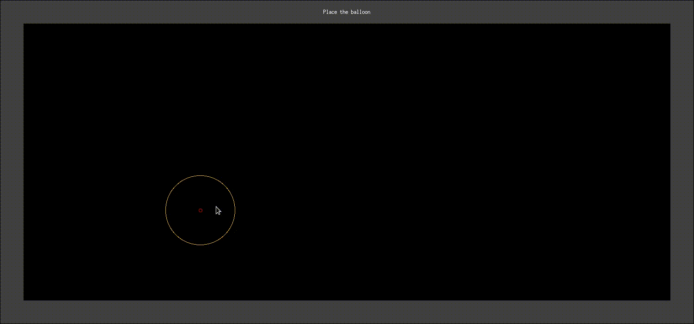
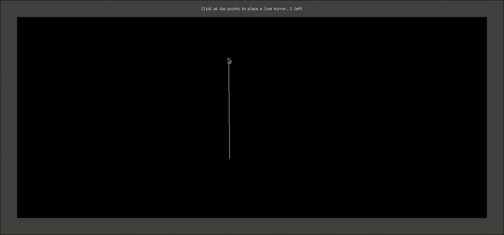
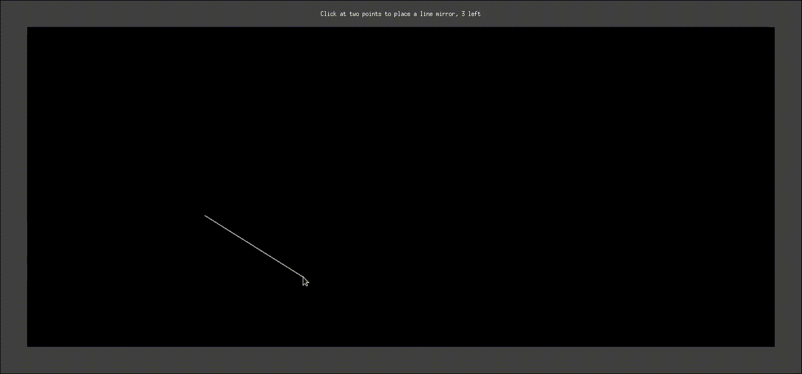
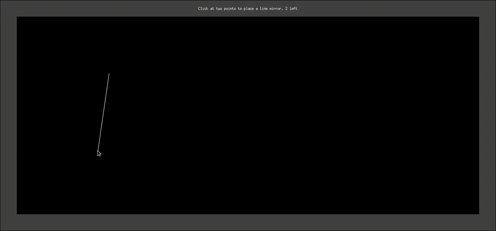
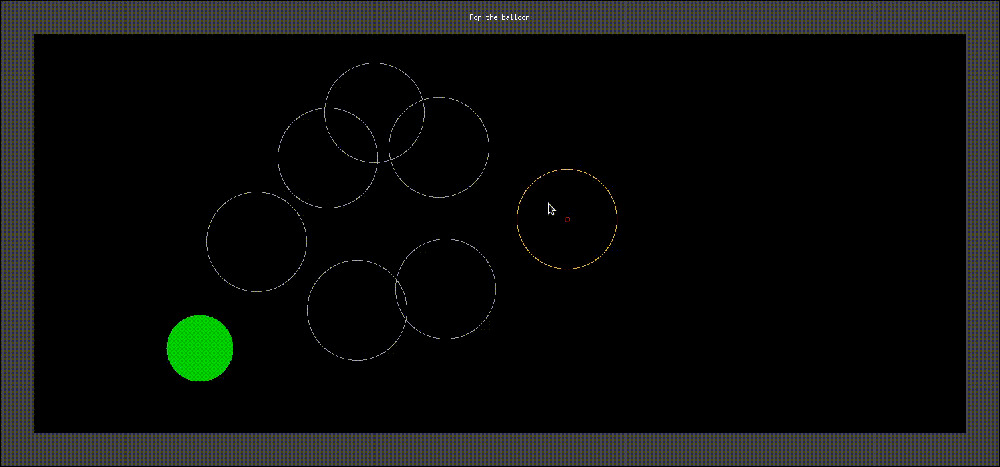
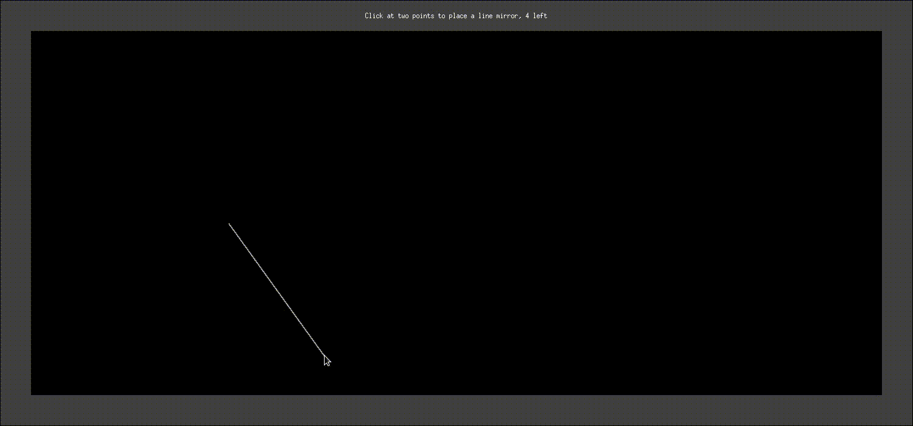

# archer

## description
- Archer is a simple aim and shoot game based on light reflection.
- It simulates reflection of light (on different types of mirrors) using ray marching technique.

## code
- The code is written in `C++`.
- All the source code is in `src/`.
- [Simplecpp](https://www.cse.iitb.ac.in/~ranade/simplecpp/) is used for rendering.
- `include` & `lib` contains headers and implementation of simplecpp.

## documentation
- The documentation for the code is itself.

## usage

### how to run? [linux]
- Make sure x11 and x11-dev are installed.
- Open terminal in the root directory.
    - Make a build directory using `mkdir build && cd build`.
    - Create a makefile using `cmake ..`
    - Compile code using `make`. This creates an executable named `archer`.
    - Use `./archer` to start playing.

### rules
- There are three types of mirror (line, circle, square).
- Specify the number of each type when prompted.
- Then
    1. Place the mirrors one by one in that order.
    1. Place a fixed laser source which emits a single ray of high energy light.
    1. Place a balloon.
- You can control the ray's direction by clicking inside concentric circles.
- The ray reflects off the mirrors following [the laws of reflection](https://en.wikipedia.org/wiki/Reflection_(physics)#Laws_of_reflection)
- The goal is to hit and pop the balloon with the light.

## demonstration
The following gifs illustrates the gameplay.

- Simplest case `(#line,#circle,#square) = (0,0,0)`.

- Single reflection `(#line,#circle,#square) = (2,0,0)`.

- Multiple reflections `(#line,#circle,#square) = (4,0,0)`.

- Difficult `(#line,#circle,#square) = (3,1,1)`.

- Very difficult `(#line,#circle,#square) = (6,0,0)`.

- Almost impossible `(#line,#circle,#square) = (5,1,1)`.

## roadmap
- [x] Basic ray marching.
- [x] Improve code.
    - [x] Light class.
    - [x] Mirrors class.
    - [x] Limits in number of mirrors.
    - [x] Game class.
    - [x] Tidy code.
    - [x] Better prompts.
    - [x] Improve text box placement.
    - [x] Better colors.
